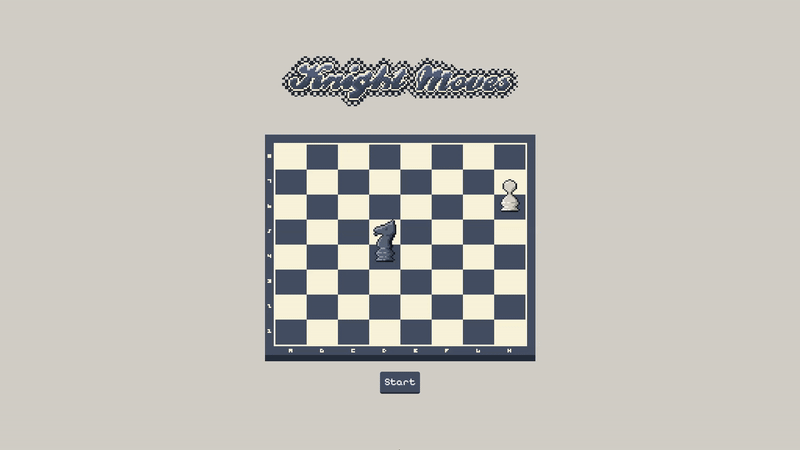

# Knight Moves

<a href='https://jimmybowcott.github.io/knight-moves/'>LIVE PAGE</a>

Interactive knight pathfinder written in vanilla JS/CSS which finds the fastest path to the specified piece using BFS. 
Drag the pieces to a square and press start to run.

## Notes

All artwork is original. Do not redistribute.

